# SSE Server MVC - Spring Boot Demo

A comprehensive demonstration of Server-Sent Events (SSE) implementation using 
Spring Boot, showcasing both Spring MVC and WebFlux approaches with progressive 
complexity.

## Quick Start

This is a standard Spring Boot application. Run it using:

```bash
./mvnw spring-boot:run
```

The application will start on `http://localhost:8080`

IntelliJ Users: There's a requests.http file in the project root 
that contains pre-configured HTTP requests for testing all the SSE endpoints 
using IntelliJ's built-in HTTP client.

## Prerequisites

- Java 21+,  we use Virtual Threads in the sample 
- Maven 3.6+
- RabbitMQ (for advanced stream examples)

## Exploring the Functionality

This project is designed to be explored in a specific order, following the 
numbered packages. Each demonstrates increasing complexity and real-world 
scenarios:

### 1. Start Here: Basic SSE Concepts (`stream_01`)

**Package:** `com.example.stream_01.one`

Begin with the fundamental SSE implementations that send a single event:

- **MVC Approach:** `/mvc/stream/one`
    - `MvcOneEventSseController.java` - Uses `SseEmitter` with background threads
    - Demonstrates all SSE fields: comments, retry time, event ID, event type, and data

- **WebFlux Approach:** `/webflux/stream/one`
    - `WebFluxOneEventSseController.java` - Uses `ServerSentEvent` with reactive streams
    - Shows reactive SSE implementation patterns

**Try these endpoints:**
```bash
curl -N -H "Accept: text/event-stream" http://localhost:8080/mvc/stream/one
curl -N -H "Accept: text/event-stream" http://localhost:8080/webflux/stream/one
```

### 2. Infinite Streams (`stream_02`)

**Package:** `com.example.stream_02.prices`

Learn how to handle continuous data streams with real-time stock price updates:

- **MVC Infinite:** `/mvc/stream/infinite`
    - `MvcInfiniteController.java` - Scheduled background tasks with `SseEmitter`
    - Demonstrates strongly-typed objects (StockPrice) serialized to JSON

- **WebFlux Infinite:** `/webflux/stream/infinite`
    - `WebFluxInfiniteController.java` - Reactive streams with `Flux.interval()`
    - Shows non-blocking reactive approach

**Try these endpoints:**
```bash
curl -N -H "Accept: text/event-stream" http://localhost:8080/mvc/stream/infinite
curl -N -H "Accept: text/event-stream" http://localhost:8080/webflux/stream/infinite?symbol=GOOGL
```

### 3. Stream Management & Resumption (`stream_03`)

**Package:** `com.example.stream_03.watchlist`

Advanced stream patterns with persistence and client resumption:

- **Stream Creation:** `POST /watchlist`
- **Stream Resumption:** `GET /watchlist` with `Last-Event-ID` header
- **Key Components:**
    - `EventStream` interface - Abstract stream operations
    - `EventId` and `StreamId` - Unique identifiers for events and streams
    - `WatchListService` - Business logic for stream lifecycle

**Try the watchlist functionality:**
```bash
# Create a new watchlist stream
curl -X POST http://localhost:8080/watchlist \
  -H "Content-Type: application/json" \
  -H "Accept: text/event-stream" \
  -d '{"symbol": "AAPL"}'

# Resume from a specific event (use Last-Event-ID from previous response)
curl -H "Last-Event-ID: your-event-id-here" \
  -H "Accept: text/event-stream" \
  http://localhost:8080/watchlist
```

### 4. Advanced Integration Patterns (`stream_04`)

**Package:** `com.example.stream_04.orders`

Complex SSE implementation demonstrating RabbitMQ integration and sophisticated response handling:

- **Hybrid API Responses:** Returns either immediate JSON or SSE stream
- **RabbitMQ Integration:** Durable event streams with persistence
- **Advanced Client Patterns:** Smart client handling of different response types

**Key Components:**
- `OrdersController.java` - Smart endpoint that returns JSON or SSE based on order status
- `ApiResponse` sealed interface - Type-safe handling of immediate vs. streaming responses
- `RabbitSseStreamFactory` - RabbitMQ stream management

**Try the orders functionality:**
```bash
# Order that executes immediately (returns JSON)
curl -X POST http://localhost:8080/orders \
  -H "Content-Type: application/json" \
  -d '{"symbol": "AAPL", "quantity": "10", "maxPrice": 190.00}'

# Order that requires streaming (returns SSE)
curl -X POST http://localhost:8080/orders \
  -H "Content-Type: application/json" \
  -H "Accept: text/event-stream" \
  -d '{"symbol": "AAPL", "quantity": "10", "maxPrice": 101.00}'

# Resume an existing order stream
curl -H "Last-Event-ID: your-event-id" \
  -H "Accept: text/event-stream" \
  http://localhost:8080/orders
```

## Additional Examples

### Async Servlet Processing
- **Endpoint:** `/servlet/async?count=8`
- **File:** `SseServlet.java`
- Demonstrates raw servlet async processing without Spring abstractions

### Advanced Client Implementation
The `stream_04` package includes `OrderClient.java`, which demonstrates sophisticated client-side handling of the hybrid API response pattern. This client shows how to:

- Handle both immediate JSON responses and SSE streams from a single endpoint
- Intelligently process different content types (`application/json` vs `text/event-stream`)
- Convert single-event streams back to immediate responses when appropriate
- Manage stream completion based on specific event types

This client implementation illustrates real-world patterns for consuming APIs that can return either immediate results or streaming responses based on business logic.

## Key Learning Points

1. **Start Simple:** Begin with single-event streams to understand SSE basics
2. **Progress to Infinite:** Learn continuous streaming patterns
3. **Add Persistence:** Understand stream management and resumption
4. **Advanced Integration:** Explore complex patterns with message queues

## Architecture Highlights

- **Spring MVC vs WebFlux:** Compare blocking vs reactive approaches
- **Background Processing:** Proper thread management for SSE
- **Error Handling:** Comprehensive error and timeout management
- **Client Resumption:** Handle network interruptions gracefully
- **Hybrid APIs:** Smart response type selection based on business logic

This progression ensures you understand both the fundamentals and advanced 
patterns needed for production SSE implementations.

## Orders Streaming 

### using RabbitMQ Stream as a source for SSE streams

### Publishing to the rabbit stream 

```mermaid
sequenceDiagram
    autonumber
    participant OC as OrdersController
    participant OS as OrderService
    participant RSP as RabbitStreamPublisher
    participant RMQ as RabbitMQ Stream

    OC->>OS: placeOrder(order, false)
    OS->>OS: attemptBuy() → LimitOrderPending
    OS->>RSP: createRabbitStreamPublisher(streamId)
    activate RSP
    Note over RSP: background loop (virtual threads publishing to RMQ)
    deactivate RSP
    OS-->>OC: ApiResponse.Stream(lastEventId)

    loop Every 500ms until executed
      OS->>RSP: publish(status, type)
      RSP->>RMQ: send message
    end
```


### Consuming the Rabbit Stream into an SSE stream from a client 

### All in one diagram


